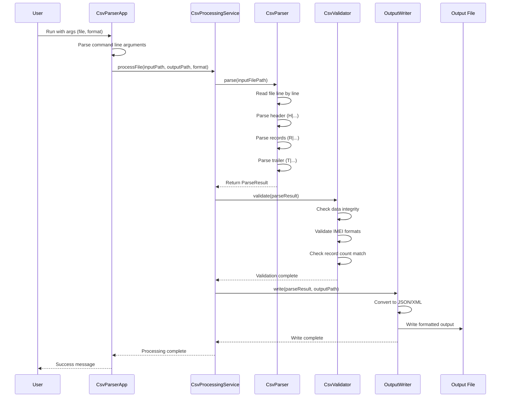
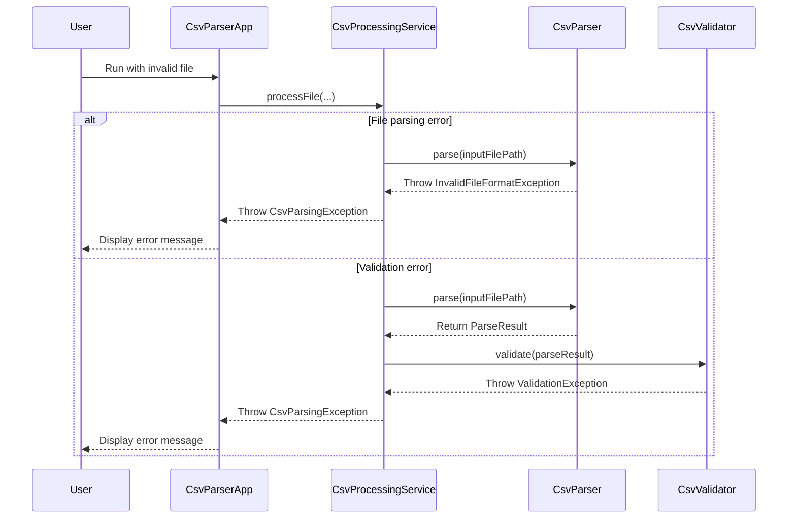

# CSV Parser Sequence Diagram



## Error Flow



## Component Architecture

```
┌─────────────────────────────────────────────────────────────┐
│                        CLI Layer                            │
│  ┌─────────────────┐  ┌─────────────────────────────────┐   │
│  │     Main.kt     │  │        CsvParserApp             │   │
│  │                 │  │  - Argument parsing             │   │
│  │                 │  │  - Error handling               │   │
│  └─────────────────┘  └─────────────────────────────────┘   │
└─────────────────────────────────────────────────────────────┘
                                   │
                                   ▼
┌─────────────────────────────────────────────────────────────┐
│                     Service Layer                          │
│  ┌─────────────────────────────────────────────────────┐   │
│  │              CsvProcessingService                   │   │
│  │  - Orchestrates parsing, validation, writing       │   │
│  │  - Manages output format selection                 │   │
│  └─────────────────────────────────────────────────────┘   │
└─────────────────────────────────────────────────────────────┘
                                   │
                                   ▼
┌─────────────────────────────────────────────────────────────┐
│                   Business Logic Layer                     │
│  ┌─────────────────┐              ┌─────────────────────┐   │
│  │    CsvParser    │              │    CsvValidator     │   │
│  │  - Line parsing │              │  - Data validation  │   │
│  │  - Format check │              │  - Business rules   │   │
│  └─────────────────┘              └─────────────────────┘   │
└─────────────────────────────────────────────────────────────┘
                                   │
                                   ▼
┌─────────────────────────────────────────────────────────────┐
│                    Output Layer                            │
│  ┌─────────────────┐              ┌─────────────────────┐   │
│  │ JsonOutputWriter│              │ XmlOutputWriter     │   │
│  │  - JSON format  │              │  - XML format       │   │
│  │  - Jackson lib  │              │  - Jackson XML      │   │
│  └─────────────────┘              └─────────────────────┘   │
└─────────────────────────────────────────────────────────────┘
                                   │
                                   ▼
┌─────────────────────────────────────────────────────────────┐
│                     Data Model Layer                       │
│  ┌─────────┐ ┌─────────────┐ ┌─────────┐ ┌─────────────┐   │
│  │ Header  │ │ DeviceLine  │ │ Trailer │ │DeviceReport │   │
│  │         │ │             │ │         │ │             │   │
│  └─────────┘ └─────────────┘ └─────────┘ └─────────────┘   │
└─────────────────────────────────────────────────────────────┘
``` 